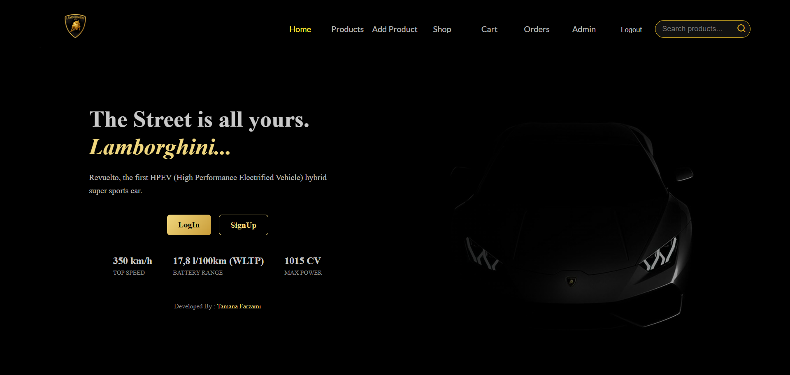
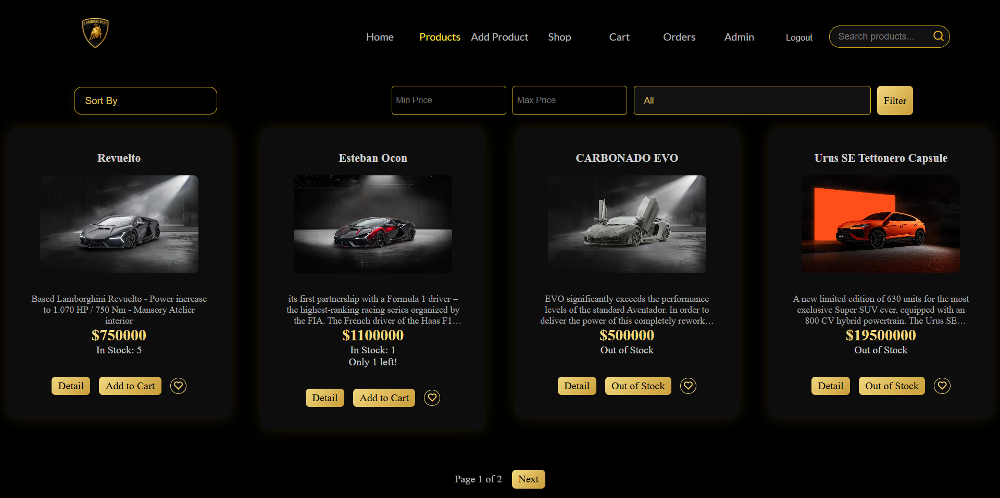
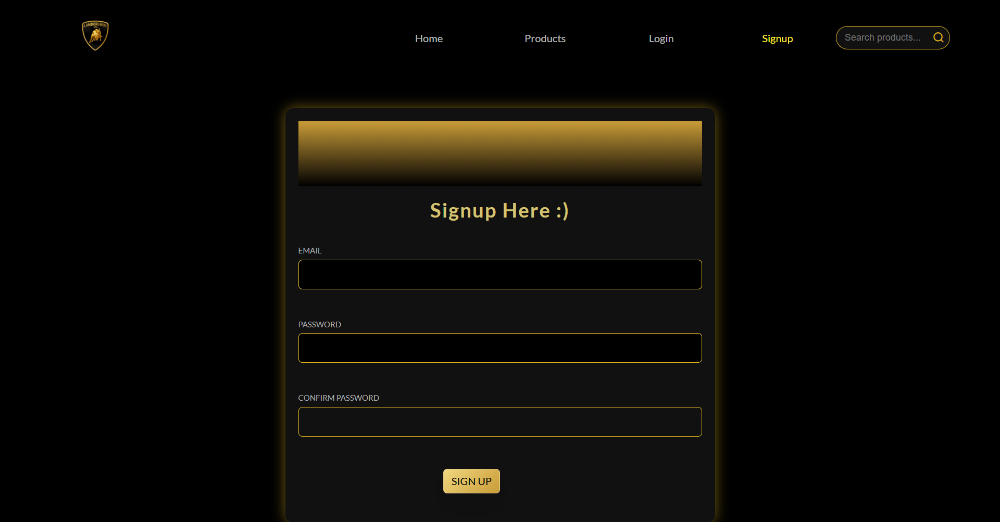
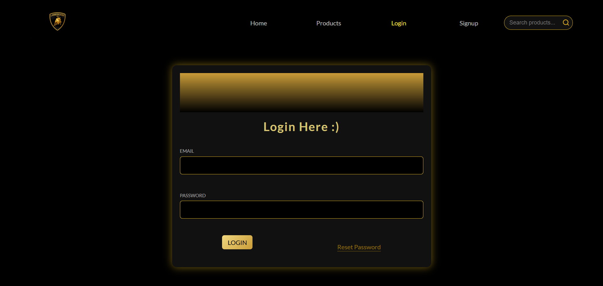

# 🚗 CarHub – Full Stack E-Commerce Platform

🌍 **Live Demo:**  
[Live](https://carhubmain.onrender.com/)

---

## 📌 Overview

CarHub is a full-stack car marketplace web application built using **Node.js, Express, MongoDB, and EJS**.  
It provides secure authentication, product management, cart functionality, and order processing in a structured MVC architecture.

This project demonstrates backend security, session handling, and full CRUD functionality in a production-ready environment.

---

## ✨ Features

### 🔐 Authentication & Security

* User Signup & Login
* Password hashing with bcrypt
* Session-based authentication
* CSRF protection
* Secure logout
* Password reset via email token
* Protected routes & middleware
* Role-based access control (Admin/User)

---

### 🚘 Product & Shopping System

* Browse all cars
* Product detail pages
* Recently viewed products
* Wishlist / Favorites system
* Persistent shopping cart
* Quantity increase / decrease
* Product stock availability system
* Product search functionality
* Filtering by category & price
* Product sorting (newest, price, A-Z)
* Pagination system

---

### ⭐ Reviews & Ratings

* Product review system
* Star rating functionality
* Average product ratings
* Duplicate review prevention

---

### 🧾 Orders & Checkout

* Checkout & payment flow
* Cash on Delivery / Card UI
* Order history
* Reorder functionality
* PDF invoice generation
* Toast notifications for actions

---

### 🛠 Admin Dashboard

* Add products
* Edit products
* Delete products
* Image preview before upload
* Product management system

---

### 🎨 UI / UX

* Responsive design
* Animated toast notifications
* Modern dark-themed UI
* Mobile navigation menu
* Improved 404 page


---

## 🔒 Security Implementation

- Passwords are securely hashed using bcrypt
- CSRF tokens required for all POST requests
- Sessions stored securely
- Authentication middleware protects sensitive routes
- Reset tokens expire automatically
---

## 📂 Project Structure


```
│── controllers/
│   └── shop.js
│   └── admin.js
│   └── auth.js
│
│── module/
│   ├── product.js
│   ├── user.js
│   ├── emailTemp.js
│   ├── invooiceTemp.js
│   └── order.js
│
│── routes/
│   └── shop.js
│   └── admin.js
│   └── auth.js
│   └── home.js
│
│── views/
│   ├── shop/
│   ├── admin/
│   └── includes/
│
│── public/
│   ├── css/
│   └── js/
│
│── data/
│── app.js
│── package.json
```

## Installation

```bash
git clone https://github.com/Tamana543/My_onlineShop.git
cd carhub
npm install
npm run start


```

#### Developers :) 
## 🔑 Environment Variables

Create a `.env` file in the root directory and add:

```env
MONGODB_URI=your_mongodb_connection
SESSION_SECRET=your_secret
BREVO_API_KEY=your_brevo_key
BASE_URL=http://localhost:3000
```

---
## Status

 👩‍💻✨Active development in progress.


---
##  What I Learned

Through building CarHub, I practiced:

* MVC architecture
* Authentication & authorization
* Session handling
* CSRF protection
* RESTful routing
* MongoDB relationships
* Full CRUD operations
* Async backend workflows
* Email API integration
* Production deployment with Render
* Frontend & backend integration

---
## Author
**Tamana&lt;ReginaJS/&gt;** 

Website Developer

---



